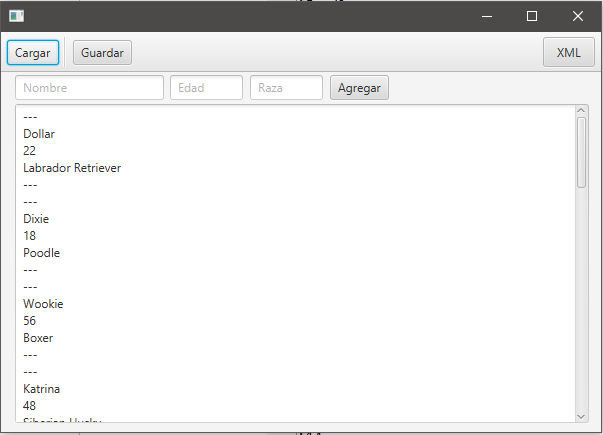
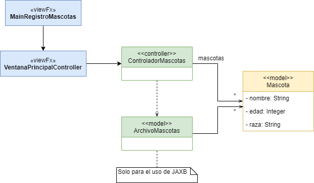

# Aplicación de Registro de Mascotas

Construya una aplicación en JavaFX donde se muestren todas las mascotas de una veterinnaria, dicha veterinaria ya cuenta con un backup de sus mascotas que se encuentra en archivos CSV o XML, posteriormente la veterinaria necesita generar nuevos backups en dichos formatos.



En este repositorio se encuentra una aplicación inicial con el MVC previamente creado, pero deberá implementar las funcionalidades requeridas a continuación:



1. Esta aplicación permite la carga de un reporte previo de mascotas en formato CSV o XML según sea especificado por un boton en pantalla, este reporte debera ser guardado en la carpeta ```res``` de este proyecto. Luego de haber cargado el reporte deberá mostrar una alerta en pantalla confirmando la carga satdisfactoria del archivo. Para lo cual debe hacer uso de un componente llamado ```FileChooser```, puede utilizar el siguiente fragmento para el uso de este componente:
  ```java
  FileChooser fileChooser = new FileChooser();
  fileChooser.setTitle("Cargar Reporte");
  fileChooser.setInitialDirectory(new File("res"));
  fileChooser.getExtensionFilters().addAll(
      new FileChooser.ExtensionFilter("TXT Files", "*.txt")
  );
  File selectedFile = fileChooser.showOpenDialog(this.loadBtn.getScene().getWindow());
  ```

2. Se podran agregar mascotas desde la pantalla utilizando una serie de textFields y un Boton.

3. Luego de agregar una nueva mascota o cargar las mascotas via archivo se debe desplegar la información de cada mascota en el textView de la pantalla (El modelo/Mascota cuenta con un sobrecarga de toString que puede utilizar para este proposito). Si desea crear Strings complejos o de gran tamaño puede usar la clase ```StringBuilder```, a continuación se muestra el uso de esta clase:
  ```java
  StringBuilder stringCompuesto = new StringBuilder(""); 
  stringCompuesto.append("nueva linea");
  stringCompuesto.toString();
  ```

4. Esta aplicación permite guardar un nuevo reporte de mascotas en formato CSV o XML según sea especificado por un boton en pantalla, este reporte deberá ser guardado en la carpeta ```res``` de este proyecto. Luego de haber guardado el reporte debera mostrar una alerta en pantalla confirmando la carga satdisfactoria del archivo Para lo cual debe hacerruso de un componente llamado ```FileChooser``` puede utilizar el siguiente fragmento para el uso de este componente:
  ```java
  FileChooser fileChooser = new FileChooser();
  fileChooser.setTitle("Cargar Reporte");
  fileChooser.setInitialDirectory(new File("res"));
  fileChooser.getExtensionFilters().addAll(
      new FileChooser.ExtensionFilter("TXT Files", "*.txt")
  );
  File selectedFile = fileChooser.showSaveDialog(this.loadBtn.getScene().getWindow());
  ```
